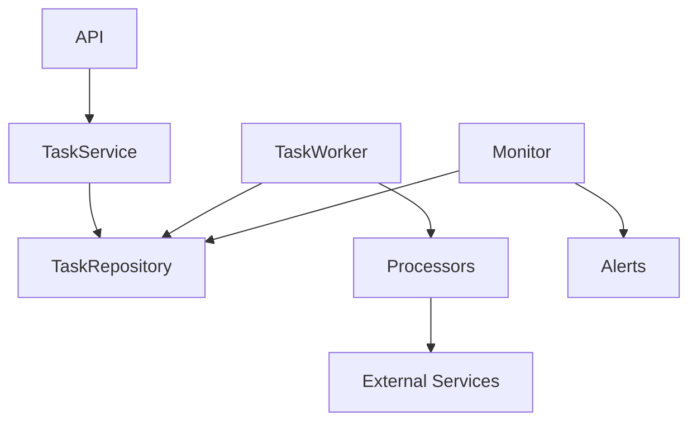

# Sistema de Tasks

## Visão Geral

O sistema de tasks é responsável por gerenciar e executar tarefas assíncronas na aplicação. Ele foi projetado seguindo os princípios de modularidade, extensibilidade e confiabilidade.

## Arquitetura

### Componentes Principais

1. **TaskModule**
   - Ponto central de configuração e inicialização
   - Gerencia ciclo de vida dos componentes
   - Registra processadores disponíveis

2. **TaskService**
   - Interface de alto nível para criar e gerenciar tasks
   - Gerencia estado e ciclo de vida das tasks
   - Coordena processamento e retry

3. **TaskRepository**
   - Persistência de tasks e execuções
   - Gerenciamento de estado
   - Queries otimizadas

4. **TaskWorker**
   - Processamento assíncrono de tasks
   - Gerenciamento de concorrência
   - Tratamento de falhas

5. **Processadores**
   - BaseProcessor: Interface comum
   - Implementações específicas:
     - BoletoProcessor
     - NFSeProcessor
     - MessageProcessor

6. **Monitoramento**
   - Métricas detalhadas (Prometheus)
   - Sistema de alertas
   - Dashboards operacionais

### Fluxo de Dados



## Tipos de Tasks

### 1. Boletos
- Emissão de boletos
- Integração com N8N
- Retry automático em caso de falha

### 2. NFSe
- Emissão de notas fiscais
- Validação de credenciais
- Tratamento de erros específicos

### 3. Mensagens
- Envio multi-canal
- Retry inteligente
- Notificação de falhas críticas

## Monitoramento

### Métricas Coletadas

1. **Contadores**
   - Tasks criadas
   - Tasks completadas
   - Tasks falhas
   - Retentativas

2. **Gauges**
   - Tasks pendentes
   - Tasks em processamento

3. **Histogramas**
   - Tempo de processamento
   - Tempo em fila

### Alertas

1. **Operacionais**
   - Alto número de tasks pendentes
   - Taxa de falha elevada
   - Tempo de processamento alto

2. **Críticos**
   - Sobrecarga do sistema
   - Falhas persistentes
   - Erros de integração

## Uso

### Criar Task

```javascript
const taskService = require('./modules/tasks/task.service');

// Criar task de boleto
await taskService.createTask('BOLETO', {
    boleto_id: 123,
    empresa_id: 456
}, {
    priority: 1,
    scheduledFor: new Date('2024-12-25'),
    maxRetries: 3
});
```

### Implementar Novo Processor

```javascript
const BaseProcessor = require('./processors/base.processor');

class CustomProcessor extends BaseProcessor {
    getTaskType() {
        return 'CUSTOM';
    }

    async process(task) {
        // Implementação específica
    }

    async canRetry(task) {
        return task.retries < 3;
    }
}
```

## Melhores Práticas

1. **Criação de Tasks**
   - Defina prioridade apropriada
   - Configure retry adequadamente
   - Valide payload antes de criar

2. **Processamento**
   - Trate erros específicos
   - Implemente retry inteligente
   - Mantenha idempotência

3. **Monitoramento**
   - Configure alertas relevantes
   - Monitore tendências
   - Ajuste thresholds conforme necessário

## Roadmap

1. **Curto Prazo**
   - Implementar rate limiting
   - Melhorar logging
   - Adicionar mais métricas

2. **Médio Prazo**
   - Implementar dead letter queue
   - Adicionar suporte a scheduled tasks
   - Melhorar dashboards

3. **Longo Prazo**
   - Distribuir processamento
   - Implementar priorização dinâmica
   - Adicionar ML para previsão de falhas
